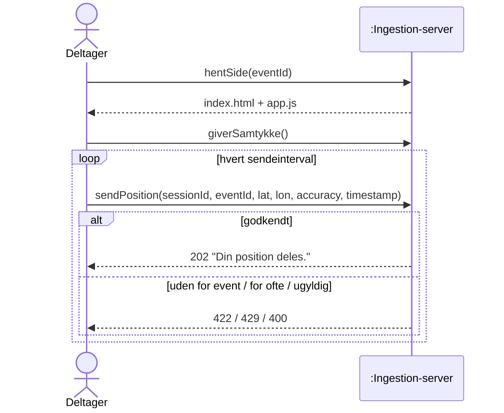

# SSD: Send position

Systemet set som sort boks fra deltagerens side. PlantUML-version: `ssd-send-position.puml`.

```mermaid
sequenceDiagram
    actor D as Deltager
    participant S as :Ingestion-server

    D->>S: hentSide(eventId)
    S-->>D: index.html + app.js
    D->>S: giverSamtykke()
    loop hvert sendeinterval
        D->>S: sendPosition(sessionId, eventId, lat, lon, accuracy, timestamp)
        alt godkendt
            S-->>D: 202 "Din position deles."
        else uden for event / for ofte / ugyldig
            S-->>D: 422 / 429 / 400
        end
    end
```
