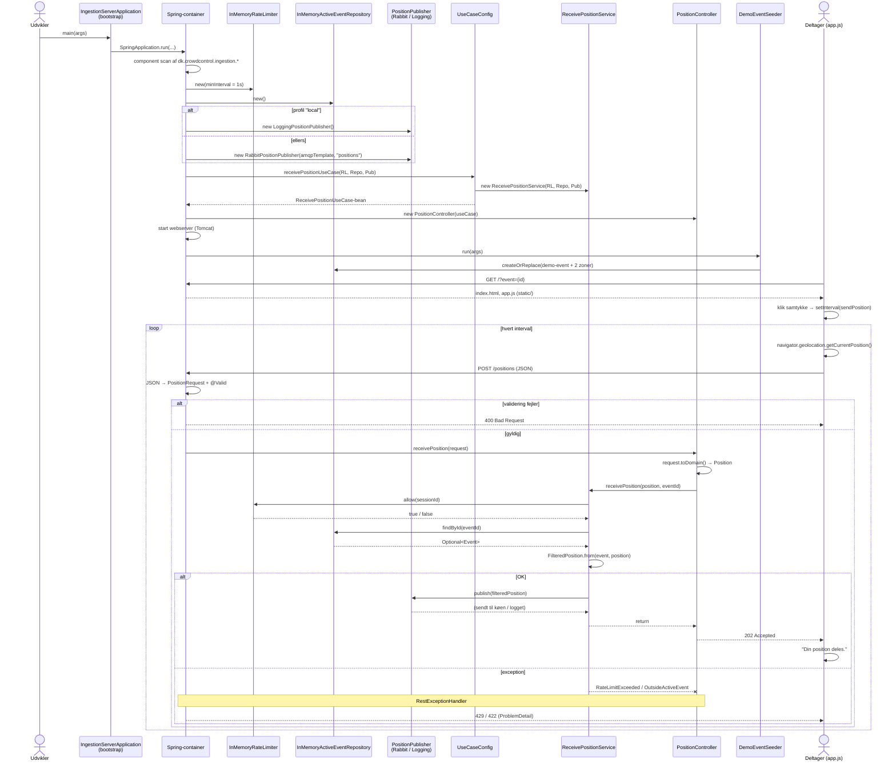

# SD: Send position (fra opstart til svar)

Forløbet i ingestion-server fra `main()` i bootstrap til mobil-appen får et svar på `POST /positions`. PlantUML-version: `sd-send-position.puml`.

```mermaid
sequenceDiagram
    actor Dev as Udvikler
    participant App as IngestionServerApplication<br/>(bootstrap)
    participant Spring as Spring-container
    participant RL as InMemoryRateLimiter
    participant Repo as InMemoryActiveEventRepository
    participant Pub as PositionPublisher<br/>(Rabbit / Logging)
    participant UCC as UseCaseConfig
    participant Svc as ReceivePositionService
    participant Ctrl as PositionController
    participant Seed as DemoEventSeeder
    actor D as Deltager (app.js)

    %% ---- Opstart ----
    Dev->>App: main(args)
    App->>Spring: SpringApplication.run(...)
    Spring->>Spring: component scan af dk.crowdcontrol.ingestion.*
    Spring->>RL: new(minInterval = 1s)
    Spring->>Repo: new()
    alt profil "local"
        Spring->>Pub: new LoggingPositionPublisher()
    else ellers
        Spring->>Pub: new RabbitPositionPublisher(amqpTemplate, "positions")
    end
    Spring->>UCC: receivePositionUseCase(RL, Repo, Pub)
    UCC->>Svc: new ReceivePositionService(RL, Repo, Pub)
    UCC-->>Spring: ReceivePositionUseCase-bean
    Spring->>Ctrl: new PositionController(useCase)
    Spring->>Spring: start webserver (Tomcat)
    Spring->>Seed: run(args)
    Seed->>Repo: createOrReplace(demo-event + 2 zoner)

    %% ---- Deltager ----
    D->>Spring: GET /?event={id}
    Spring-->>D: index.html, app.js (static/)
    D->>D: klik samtykke → setInterval(sendPosition)
    loop hvert interval
        D->>D: navigator.geolocation.getCurrentPosition()
        D->>Spring: POST /positions (JSON)
        Spring->>Spring: JSON → PositionRequest + @Valid
        alt validering fejler
            Spring-->>D: 400 Bad Request
        else gyldig
            Spring->>Ctrl: receivePosition(request)
            Ctrl->>Ctrl: request.toDomain() → Position
            Ctrl->>Svc: receivePosition(position, eventId)
            Svc->>RL: allow(sessionId)
            RL-->>Svc: true / false
            Svc->>Repo: findById(eventId)
            Repo-->>Svc: Optional<Event>
            Svc->>Svc: FilteredPosition.from(event, position)
            alt OK
                Svc->>Pub: publish(filteredPosition)
                Pub-->>Svc: (sendt til køen / logget)
                Svc-->>Ctrl: return
                Ctrl-->>D: 202 Accepted
                D->>D: "Din position deles."
            else exception
                Svc--xCtrl: RateLimitExceeded / OutsideActiveEvent
                Note over Ctrl,Spring: RestExceptionHandler
                Spring-->>D: 429 / 422 (ProblemDetail)
            end
        end
    end
```
